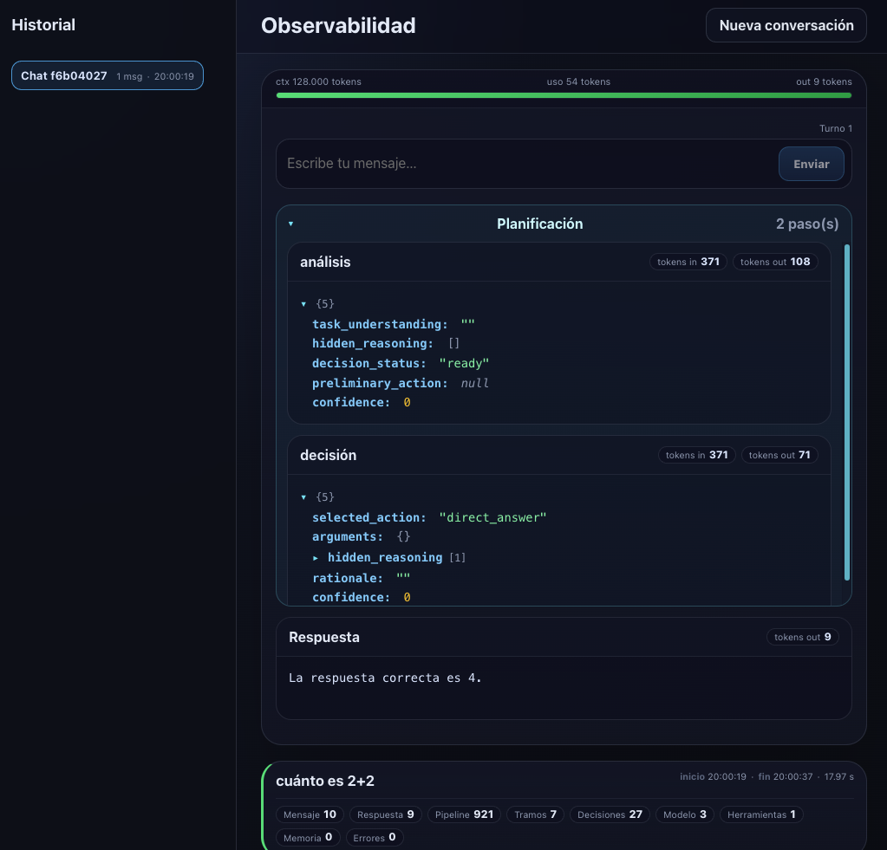
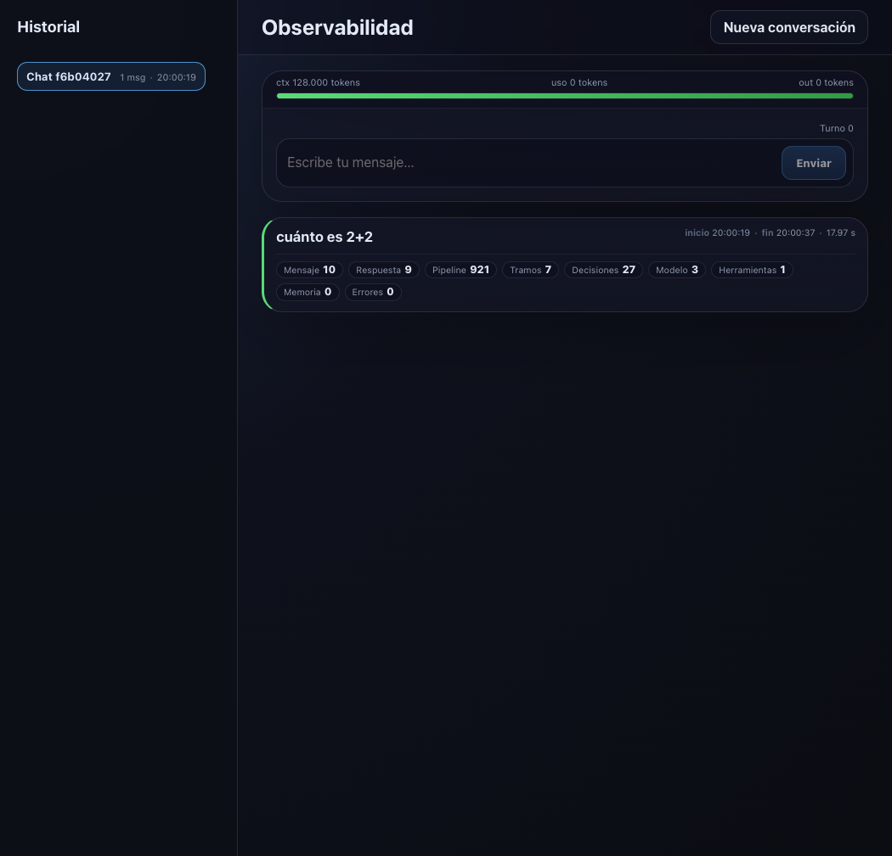
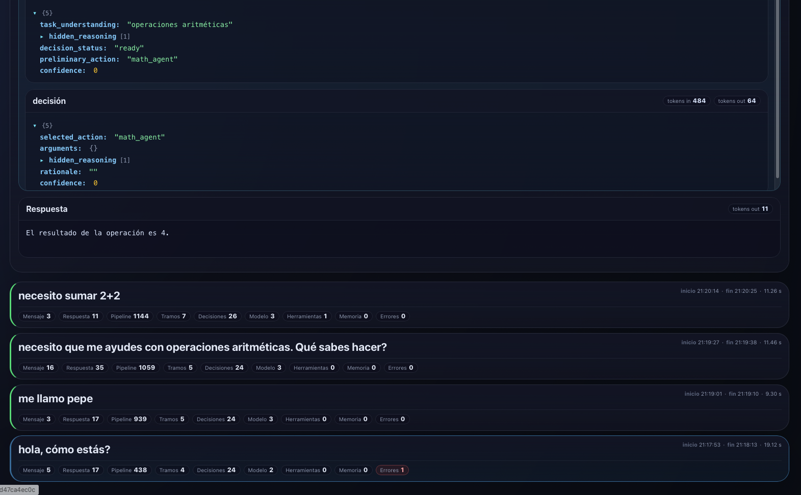
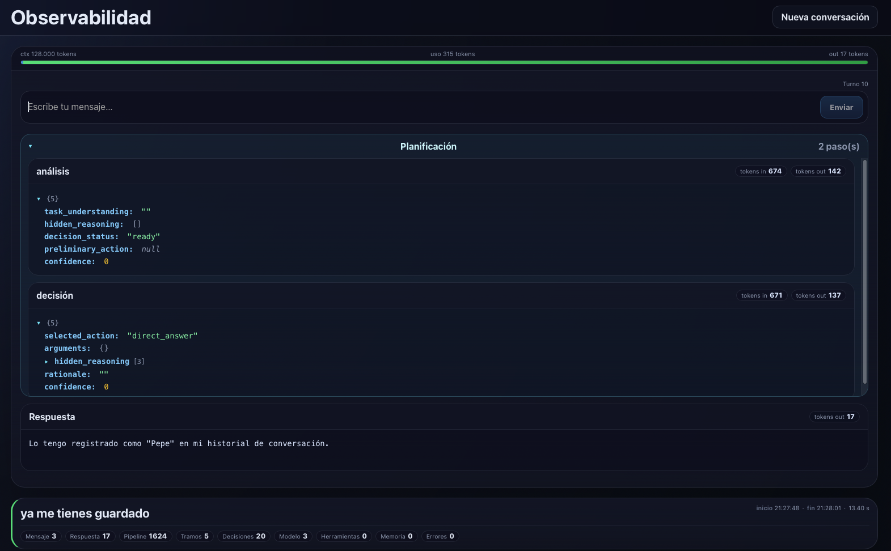
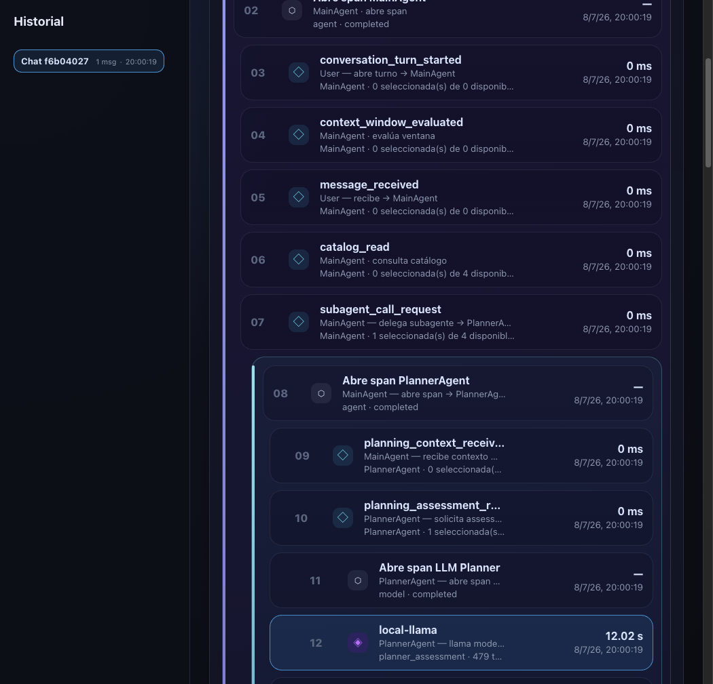
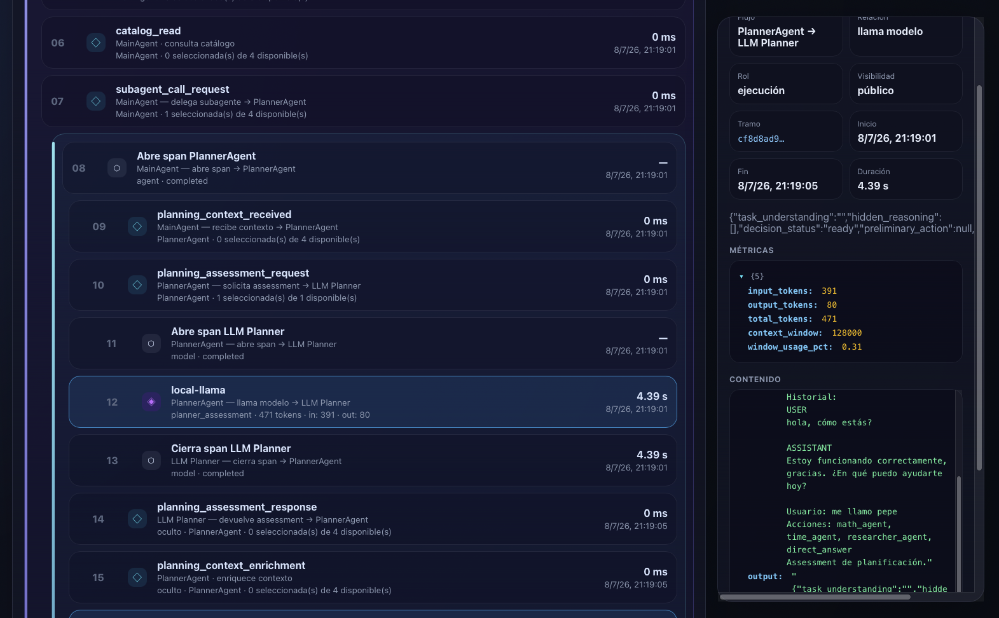
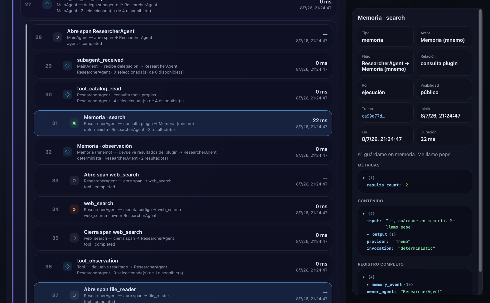
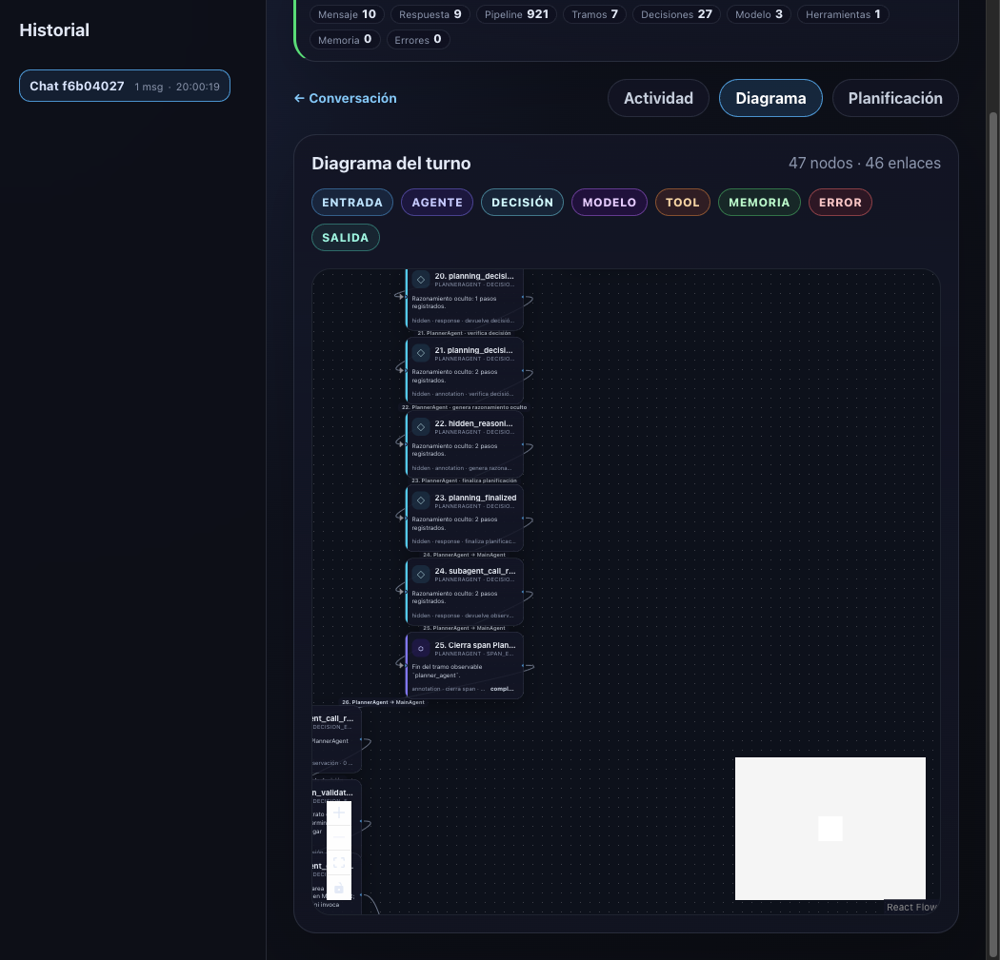
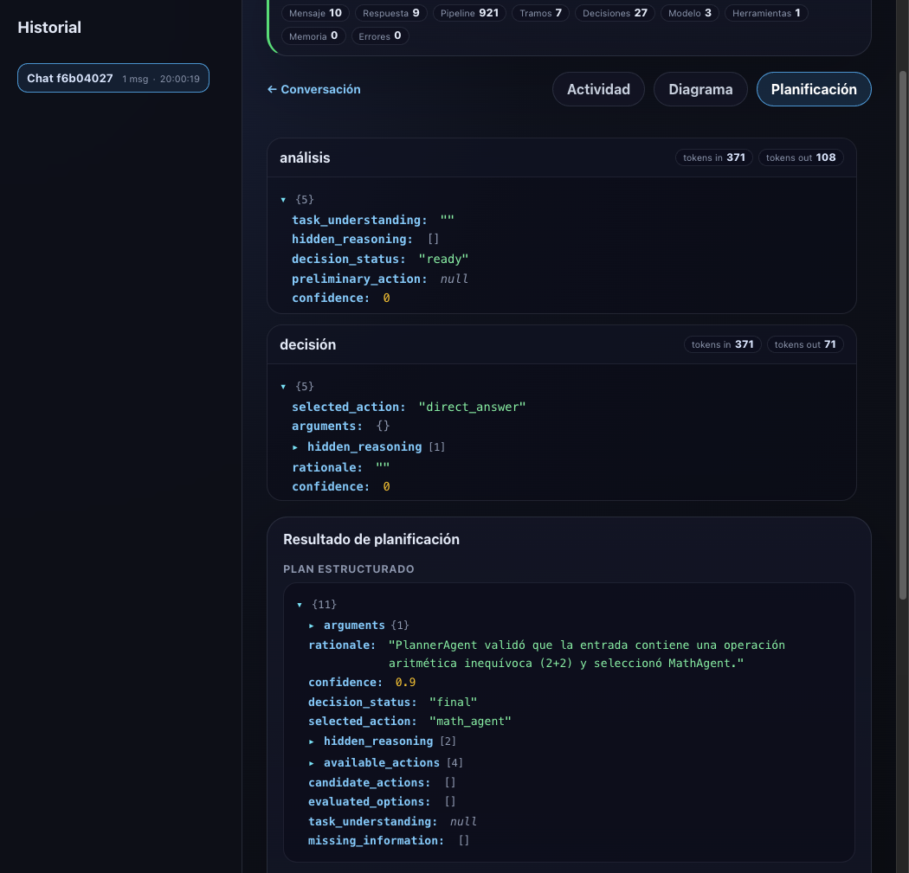

# Observabilidad en sistemas agénticos basados en modelos de lenguaje

Prototipo de validación desarrollado como Trabajo de Fin de Estudio del **Grado en Ingeniería Informática** de la **Universidad Internacional de La Rioja (UNIR)**.

**Autor**: José Antonio Meira Corbal  
**Licencia**: Apache 2.0 (véase el fichero `LICENSE`)

---

El prototipo implementa una arquitectura de observabilidad para sistemas agénticos basados en LLM, con un núcleo de trazabilidad propio (runs y spans jerárquicos), captura del razonamiento del planificador mediante `DecisionEvent` y una interfaz de visualización del flujo de ejecución.

## Servicios

| Servicio | Puerto | Descripción |
|---|---|---|
| `agent-api` | 8000 | Agente con `MainAgent` + subagentes, endpoint `/invoke` |
| `observability-api` | 8001 | Colector de runs/spans y eventos (Postgres) |
| `observability-ui` | 3000 | Dashboard web para explorar runs, timelines y diagramas |
| `litellm` | 4000 | Gateway LLM OpenAI-compatible |
| `postgres` | 5432 | Almacenamiento |
| `redis` | 6379 | Cache |
| `ollama` | 11434 | LLM local (llama3.2:3b) |

## Estructura del "harness"

```
harness/app/
├── main.py                 # FastAPI que incluye el método /invoke para los span
├── llm/gateway.py          # cliente LiteLLM (ChatOpenAI)
├── observability/
│   ├── models.py           # Run, Span, ModelCall, ...
│   ├── tracer.py           # núcleo del arnés
│   ├── context.py
│   └── decorators.py
├── agents/
│   ├── main_agent.py
│   ├── planner_agent.py
│   ├── math_agent.py
│   ├── time_agent.py
│   ├── researcher_agent.py
│   ├── writer_agent.py
│   ├── registry.py
│   └── observability_helpers.py
├── tools/
│   ├── calculator.py
│   ├── clock.py
│   ├── file_reader.py
│   └── web_search.py       # simulada, sin red
├── memory/
│   ├── store.py            # wrapper CLI mnemo
│   └── service.py          # search_memory / save_memory
└── data/docs/              # documentos locales para file_reader
```

## Memoria (mnemo)

El agente persiste memoria entre ejecuciones con [mnemo](https://github.com/jmeiracorbal/mnemo) (binario Go invocado por CLI desde `memory/store.py`).

- El binario se instala en la imagen `agent-api` (`mnemo-linux-<arch>` del último release).
- La base SQLite vive en el volumen Docker `mnemo_data` montado en `/root/.mnemo`.
- Scope por proyecto vía `MNEMO_PROJECT` (en compose: `tfg-poc`).

Flujo: el `WriterAgent` guarda el documento final (`memory_event save`); en invocaciones posteriores el `ResearcherAgent` lo recupera con `search_memory` (`memory_event search`).

## Arquitectura del runtime agéntico

El runtime separa claramente **orquestación**, **planificación**, **subagentes** y **tools**:

- `MainAgent` es el orquestador. No ejecuta tools de dominio y no construye argumentos internos de esas tools.
- `PlannerAgent` es un subagente real con span propio. Recibe el catálogo público del `AgentRegistry`, ejecuta un bucle de planificación con `LLM Planner` y devuelve el plan estructurado a `MainAgent`.
- El bucle de planificación registra assessment, enriquecimiento de contexto, decisión final y `hidden_reasoning` marcado como razonamiento oculto/interno del proyecto.
- `MainAgent` valida solo el contrato estructural de la decisión: acción existente y tarea delegable.
- El subagente seleccionado recibe una `task` textual y decide internamente qué tool usar y con qué argumentos.
- `LLM Final` redacta la respuesta final usando la observación devuelta por el subagente/runtime.

### AgentRegistry

`harness/app/agents/registry.py` define el catálogo público que se muestra al planner:

| Acción | Target | Capacidades públicas | Tools visibles |
|---|---|---|---|
| `math_agent` | `MathAgent` | Cálculos y expresiones aritméticas | `calculator` |
| `time_agent` | `TimeAgent` | Hora/fecha actual | `clock` |
| `researcher_agent` | `ResearcherAgent` | Investigación, memoria, búsqueda simulada, lectura local y síntesis | `memory.search`, `web_search`, `file_reader`, `llm_synthesis` |
| `direct_answer` | `LLM Final` | Respuesta directa sin tool de dominio | — |

Importante: las tools son visibles para que el LLM entienda las capacidades de cada agente, pero **no son tools directas del `MainAgent`**.

### Propiedad de tools

| Tool / operación | Owner real | Quién la selecciona | Quién la ejecuta |
|---|---|---|---|
| `calculator` | `MathAgent` | `MathAgent` | código Python de `tools/calculator.py` |
| `clock` | `TimeAgent` | `TimeAgent` | código Python de `tools/clock.py` |
| `memory.search` | `ResearcherAgent` | `ResearcherAgent` | `memory/service.py` |
| `web_search` | `ResearcherAgent` | `ResearcherAgent` | `tools/web_search.py` |
| `file_reader` | `ResearcherAgent` | `ResearcherAgent` | `tools/file_reader.py` |
| `llm_synthesis` | `ResearcherAgent` | `ResearcherAgent` | LiteLLM gateway |
| `llm_draft` | `WriterAgent` | `WriterAgent` | LiteLLM gateway |
| `memory.save` | `WriterAgent` | `WriterAgent` | `memory/service.py` |

## Despliegue

En una consola:

```bash
docker compose up --build
```

En otra consola ejecutamos la descarga del modelo. Al utilizar Ollama, este no descarga el modelo al arrancar.

```bash
docker exec tfg-ollama ollama pull llama3.2:3b
```

Hasta que el modelo no esté descargado, las invocaciones fallarán con `model 'llama3.2:3b' not found`.

Sanidad del binario mnemo:

```bash
docker exec tfg-agent-api mnemo version
```

## Pruebas

Enviar mensaje al agente:

```bash
curl -X POST http://localhost:8000/invoke \
  -H "Content-Type: application/json" \
  -d '{"message": "¿Qué es la observabilidad?"}'
```

La respuesta final es el documento redactado por el `WriterAgent`.

Ejemplo de cálculo:

```bash
curl -X POST http://localhost:8000/invoke \
  -H "Content-Type: application/json" \
  -d '{"message": "2+2"}'
```

En este caso el flujo esperado es:

```txt
MainAgent → PlannerAgent → LLM Planner assessment → PlannerAgent → LLM Planner decision → PlannerAgent → MainAgent → MathAgent → calculator → MathAgent → MainAgent → LLM Final
```

`MainAgent` no extrae `2+2`: delega la tarea textual a `MathAgent`; `MathAgent` registra `tool_selection`, extrae la expresión y ejecuta `calculator`.

Consultar timeline completo de una ejecución:

```bash
curl "http://localhost:8001/runs/<run_id>/timeline"
```

Abrir el dashboard web:

```bash
open http://localhost:3000
```

La UI consume `observability-api` desde el navegador. No usa archivos `.env`; la URL pública se define en `compose.yml` con `OBSERVABILITY_API_URL`.

Un segundo `/invoke` con un tema similar debería mostrar `results_count > 0` en el `memory_event search` del researcher (memoria persistente en mnemo).

## Invoke

Secuencia esperada por cada `/invoke`:

```
User
→ MainAgent recibe mensaje
→ MainAgent consulta AgentRegistry: acciones, subagentes, capacidades públicas y tools visibles
→ MainAgent delega planificación en PlannerAgent
→ PlannerAgent llama a LLM Planner para assessment
→ LLM Planner devuelve assessment con hidden_reasoning
→ PlannerAgent repara el assessment si el proveedor no devolvió JSON válido
→ PlannerAgent enriquece contexto
→ PlannerAgent llama a LLM Planner para decisión final
→ LLM Planner devuelve decisión con hidden_reasoning
→ PlannerAgent repara la decisión si el proveedor no devolvió JSON válido o contradice una señal inequívoca
→ PlannerAgent devuelve plan a MainAgent
→ MainAgent valida el contrato estructural de delegación
→ MainAgent delega en MathAgent/TimeAgent/ResearcherAgent o elige direct_answer
→ Subagente consulta sus tools propias y decide tool/argumentos internos
→ Subagente solicita y ejecuta tool/modelo/memoria
→ Subagente devuelve observación a MainAgent
→ MainAgent llama a LLM Final con la observación
→ LLM Final devuelve respuesta
→ MainAgent responde al usuario
```

El flujo registra `decision_event` para explicar decisiones observables del runtime sin exponer chain-of-thought libre:

```
message_received
→ catalog_read
→ subagent_call_request (PlannerAgent)
→ subagent_received
→ planning_context_received
→ planning_assessment_request
→ model_call (planner_assessment)
→ planning_assessment_response
→ planning_context_enrichment
→ planning_decision_request
→ model_call (planner_decision)
→ planning_decision_response
→ hidden_reasoning_generated
→ planning_finalized
→ subagent_call_response (plan)
→ decision_validation
→ subagent_call_request / direct_answer_selected
→ subagent_received
→ tool_catalog_read / tool_selection / model_call_request / memory_observation
→ tool_call / model_call / memory_event
→ tool_observation / model_observation / memory_persistence
→ subagent_call_response
→ final_model_request
→ model_call (respuesta final)
→ final_model_response
→ final_response
```

Las tools de dominio no pertenecen al `MainAgent`: `calculator` es propiedad de `MathAgent`, `clock` de `TimeAgent`, y `web_search`/`file_reader`/memoria/síntesis pertenecen a `ResearcherAgent` o `WriterAgent`. `MainAgent` conoce el catálogo público de agentes, capacidades y tools visibles para que `PlannerAgent`/LLM Planner pueda decidir, pero no parsea cálculos ni construye argumentos internos de tools. El timeline incluye `owner_agent`, `purpose`, actores origen/destino, tokens, contenido estructurado, `hidden_reasoning` etiquetado como oculto, respuesta final visible, eventos genéricos legacy y payloads reales.

Listar ejecuciones:

```bash
curl http://localhost:8001/runs
```

Health checks:

```bash
curl http://localhost:8000/health
curl http://localhost:8001/health
curl http://localhost:4000/health/liveliness
```

## Endpoints del colector

Ubicado en la aplicación `observability-api`:
- Endpoints de ingesta: `POST /runs`, `POST /runs/{id}/end`, `POST /spans`, `POST /spans/{id}/end`, `POST /model_calls`, `POST /tool_calls`, `POST /memory_events`, `POST /decision_events`, `POST /errors`.
- Endpoints de consulta: `GET /runs`, `GET /runs/{id}/timeline`, `GET /events` (legacy).

## Observability UI

Ubicada en `harness/observability-ui/`.

- React + Vite + TypeScript.
- Vista de lista de ejecuciones.
- Resumen del run seleccionado.
- Invoke en vivo con planificación (análisis/decisión), pestaña **Respuesta** y métricas del turno (mensaje, pipeline, tramos, decisiones, errores).
- Timeline secuencial de spans, decisiones, llamadas a modelo, herramientas, memoria y errores.
- Eventos de decisión del agente: recepción, AgentRegistry, planner LLM, validación estructural, delegación, catálogo de tools propias, selección interna de tool, ejecución, observación y respuesta.
- Diagrama de artefactos con React Flow construido desde el timeline real, no desde un árbol agregado.
- Inspector JSON para payloads reales.

### Capturas

| Área | Vista | Captura | Descripción |
|---|---|---|---|
| Conversación | Invoke en vivo |  | Barra de contexto, planificación en vivo (análisis/decisión) y respuesta final. |
| Conversación | Historial |  | Historial lateral, invoke, barra de contexto y tarjeta resumen del turno. |
| Conversación | Respuesta (cálculo) |  | Planificación en dos pasos, respuesta final (`2+2`) y métricas del turno (pipeline, tramos, decisiones). |
| Conversación | Respuesta (math_agent) |  | Decisión `math_agent`, resultado aritmético e historial de ejecuciones dentro de la misma conversación. |
| Conversación | Respuesta (memoria) |  | Recall de un hecho del usuario (`Pepe`) con planificación visible y métricas sin errores. |
| Detalle del turno | Actividad |  | Timeline jerárquico por agente e inspector del paso seleccionado. |
| Detalle del turno | Actividad (model_call) |  | Detalle de `local-llama` en el planner: tokens, ventana de contexto, historial y salida JSON. |
| Detalle del turno | Actividad (memoria) |  | `memory.search` del ResearcherAgent contra mnemo con `results_count` y payload del plugin. |
| Detalle del turno | Diagrama |  | Grafo React Flow con nodos tipados y leyenda. |
| Detalle del turno | Planificación |  | Assessment, decisión y plan final con JSON expandible. |
